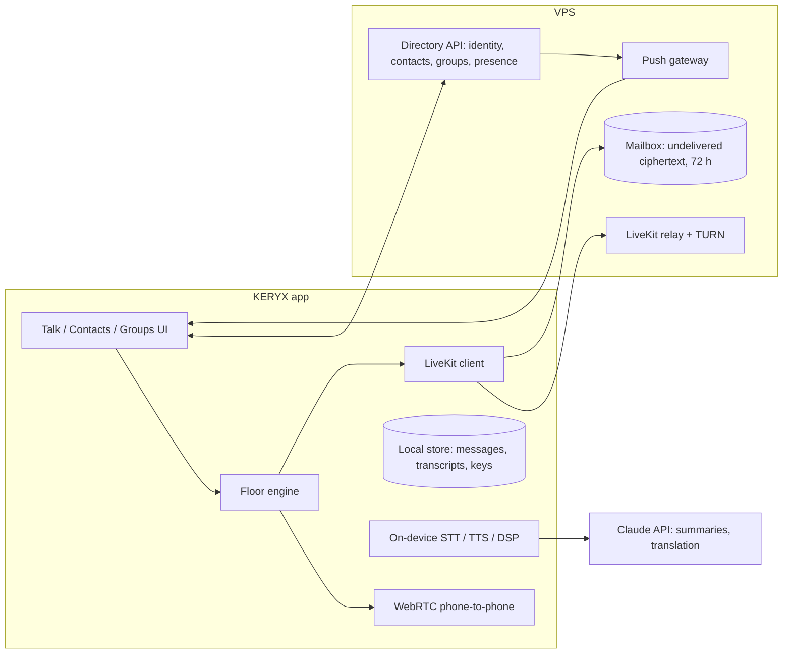

# KERYX v2 — Product Model

> **Version:** 0.2 (approved model; §10 answered) | **Date:** 2026-09-11 | **Author:** ORCH from owner decisions of 2026-09-11
> **Supersedes, on approval:** the channel-first information architecture of `KERYX_Mobile_UX_Redesign_Design_v1.0.md` §1 and the numbered-channel model of `KERYX_Product_Technical_Spec_v1.1.md` (FR-001 family, privacy codes, the "Zello-style lobbies are the anti-persona" clause).
> **Keeps:** the floor engine (one speaker at a time, TOT, emergency pre-emption), the WebRTC/LiveKit voice path, the audio-session fix, the UX R2 Talk surface, and the privacy commitments of Verification §8 (no address-book upload, no analytics without consent).

## 0. Why v2

KERYX v1 is a radio: you pick channel 01·00 and anyone on the same number can hear you. That was easy to build and needs no server, but it fails the first thing a real user does, which is press the button when no one is there and wonder why nothing happens. People do not think in channel numbers. They think in *who*: my brother, the site crew, the school-run group.

v2 turns KERYX into a people-first push-to-talk app: contacts, groups, presence, and voice that is delivered even when the other person is not listening right now. The five-year goal (the BHAG) is to overtake Zello. Zello's weaknesses are the opening:

| Zello | KERYX v2 |
|---|---|
| Needs the internet for everything | Talks phone-to-phone on the same Wi‑Fi with no server at all; uses the relay only when it must |
| Usernames and a central account | A key-based KERYX ID; no phone number, no password, no address-book upload |
| Voice only, in one language | Live captions, text-to-voice, real-time translation, and audio transforms built in |
| Recording history stored on Zello's servers | Voice messages held briefly for delivery, then gone; history lives on your phone with an expiry you set |

## 1. Owner decisions (2026-09-11)

| # | Decision |
|---|---|
| D1 | **Identity is a KERYX ID only.** No phone-number lookup in v2; it may come later as an opt-in. |
| D2 | **Voice messages are kept on phones only**, expiring after a set time. The server holds a message only until it is delivered (or a short deadline), then deletes it. Server capacity stays small. |
| D3 | **The radio layer is dropped.** No numbered channels, no privacy codes, no "tune". People, groups and presence replace them. Direct phone-to-phone talk on the same Wi‑Fi stays as a *transport*, invisible to the user. |
| D4 | **Host a small database** (identities, contact links, groups, presence, undelivered mailbox) on the existing relay VPS. |
| D5 | **AI is core**, not a bolt-on: voice-to-text, text-to-voice, real-time translation, and spoken-audio transforms are on the roadmap from the start. |
| D6 | **Message retention defaults to 7 days** on the phone (user-adjustable). |
| D7 | **Group size cap is 25** for v2.0. |
| D8 | **No pricing decisions yet.** Build the full feature set first; decide free vs paid, and paid levels, afterwards. Nothing in the specs may assume a paywall. |
| D9 | **Callsigns are not unique**; the short code disambiguates. |
| D10 | **ID backup is a 12-word recovery phrase**, never a cloud copy of the key. |
| D11 | **Style lens**: AI may rewrite the *words* of a message for the audience (formal for a boss, plain language, generation-appropriate phrasing in both directions), always marked, never altering who is speaking. |

## 2. Core concepts

**KERYX ID.** Every install generates a key pair on first run. The public key's fingerprint, shown as a callsign plus a short code (`ALISTER·7K3Q`), is the person's identity. It can be shown as a QR code or shared as a link (`keryx.app/c/ALISTER-7K3Q`). Losing the phone loses the ID unless the user has written down the 12-word recovery phrase shown at first run (restore is v2.1).

**Contact.** A mutual link between two IDs. Either side can remove it, and removal is silent. Contacts see each other's presence and can talk 1:1.

**Group.** A named room with a member list and a shared secret key. Anyone holding the key can join; the creator (and any admins they name) can rotate the key, which removes everyone not re-invited. This is the WhatsApp-group idea, built on the keyed-room mechanism v1 already has for Event QR.

**Presence.** One of **Available**, **Busy**, **Do Not Disturb**, **Offline**, set by the user, with **Talking** and **On Wi‑Fi nearby** derived automatically. Presence is shown before you press, so the ring tells you whether anyone can hear you.

**Talk.** Live push-to-talk to a contact or group. One speaker at a time, arbitrated by the existing floor engine. If a listener is reachable on the same Wi‑Fi the audio goes phone-to-phone; otherwise through the relay.

**Voice message.** What a Talk becomes when the target is Offline, in DND, or simply not listening: the same press, delivered later. Playback is chronological, like a walkie-talkie log. This is what answers "I pressed and nothing happened".

**Alert.** A deliberate "ring this person" that breaks through Busy and DND once, with a sound and a vibration. Rate-limited to stop abuse.

**Emergency.** The existing emergency control becomes "emergency to everyone I'm connected to": it pre-empts the floor in every group you share, alerts every contact, and stays pinned until you clear it.

## 3. Flows

### 3.1 First run
Pick a callsign. The app creates the key pair and shows the ID and QR. There is no sign-up form and no verification code. The Talk screen opens with "Add your first contact" in place of a ring.

### 3.2 Adding a contact
- **In person:** one phone shows its QR, the other scans it. The scanner's phone sends a request; the shown phone displays "Add ALISTER·7K3Q?" with Accept / Decline. Accept creates the link on both sides.
- **By link:** share `keryx.app/c/<id>` over any messenger. Tapping it opens KERYX (or the store) and sends the request. The same Accept step applies.
- Requests expire after 7 days. Blocked IDs cannot request again.

### 3.3 Creating and joining a group
Create → name → the app generates the group key → share as QR or link. A joiner presents the link; the app checks the key, registers membership with the server, and the member list updates for everyone. Leaving is one tap; removing a member is "rotate key and re-invite the rest" done for the admin in one action.

### 3.4 Talking
Open a contact or a group, press and hold. The ring is amber (ready), turns red when you hold the floor, green when someone else does. If nobody is listening the press still records and the app says "Sent as a message". Releasing sends.

### 3.5 Receiving
Live audio plays through the loudspeaker as now. A message arriving while the app is closed shows a notification with a play button; opening the group plays the queue in order. DND suppresses sound and notification (the badge still counts). Alerts break through once.

### 3.6 Statuses
Available and Busy are visible hints only; talk still flows. DND silences live talk and notifications, but stores messages. Offline is automatic after 5 minutes without a heartbeat, or manual ("appear offline").

## 4. Data and storage policy

The server is a directory and a short-lived mailbox, not an archive.

| Data | Where | Retention |
|---|---|---|
| Public key, callsign, presence | Server | While the account exists |
| Contact links, group membership, group key (encrypted to members) | Server | While the link/group exists |
| Undelivered voice messages | Server, encrypted | Until delivered, or 72 hours, then deleted |
| Delivered voice messages, transcripts | Phone only | User-set expiry: 24 h / 7 d / 30 d / never; default 7 d |
| Live talk audio | Nowhere | Never stored unless the user pins it before it expires |

Voice is Opus at 24 kbps; a 10-second message is ~30 KB. A thousand active users leaving ten undelivered messages a day is under 300 MB of transient server storage. The VPS you have is enough for the first year.

## 5. Security and privacy

- **Identity is cryptographic.** Contact requests and group invites are signed; the server cannot forge a link.
- **End-to-end encryption.** 1:1 talk is keyed from both parties' keys; group talk is keyed from the group secret. The relay forwards ciphertext. The mailbox holds ciphertext.
- **No phone numbers, no address book.** Discovery is QR, link, or (later, opt-in) hashed phone lookup that never uploads a contact list.
- **Presence is contacts-only.** Nobody outside your contact list can see whether you are online.
- **Abuse controls.** Block, report, per-sender rate limits on requests and alerts.
- **AI features that leave the phone are opt-in per group**, with a visible "AI on" mark, because transcripts and translations of a group's audio are sent to a model.

## 6. AI features

The principle: on-device first, cloud when quality demands it, and always visible to the people in the conversation.

| Feature | What the user gets | How | Phase |
|---|---|---|---|
| **Live captions** | Every transmission appears as text under the ring; the log is searchable | On-device speech recognition (Android's built-in engine, or a Whisper-class model on capable phones) | v2.2 |
| **Text-to-voice** | Type in a noisy or quiet place; it is spoken in the group with a "typed" marker | On-device text-to-speech; cloud voices as a Pro option | v2.2 |
| **What did I miss** | One tap summarises the last hour of a group in three lines | Captions sent to Claude (`claude-opus-5`) with a summarisation prompt; opt-in per group | v2.2 |
| **Real-time translation** | You speak Afrikaans, they hear English; each listener picks their language | Captions → Claude translation → on-device TTS in the listener's language. Latency target 2 s end-to-end. Cloud speech for accuracy where on-device falls short | v2.3 |
| **Audio transforms** | Noise cleanup on building sites; "radio voice" and other effects; slow-down replay | Noise suppression on-device (WebRTC + RNNoise); effects as local DSP; no voice cloning of other people | v2.3 |
| **Style lens** | Send-side: "make this formal" before it goes to your boss; "plain language"; "shorter". Listen-side: hear a teenager's message in adult phrasing, or an adult's in the teenager's own register. The original is always one tap away and the message carries a "restyled" mark | Same pipeline as translation: captions → Claude rewrite with a style prompt → text or on-device TTS. Send-side rewrites are shown for approval before sending | v2.3 |
| **Voice commands** | "KERYX, call the crew", "KERYX, mute for an hour" | On-device wake word + intent; Claude for free-form requests | v3 |
| **Keyword alerts** | Get pinged when your name or "help" is said in a busy group | Runs on the caption stream, on-device | v3 |

Cost posture: on-device features cost nothing per use. Cloud features are metered per use so their cost is known; whether and how they are charged for is decided after the full version ships (D8).

## 7. Architecture

- **Kept from v1:** floor engine, WebRTC mesh, LiveKit relay, TURN, the Android audio-session fix, the R2 Talk/tab shell, the keyed-room crypto.
- **New on the client:** key-pair identity, contacts and groups screens, presence, message queue and player, captions overlay, settings for retention and AI opt-in.
- **New on the server:** the directory API (FastAPI + PostgreSQL, grown from the token service), presence over WebSocket with a 60-second heartbeat, the mailbox, and push (FCM).
- **Transport choice:** when a target is on the same Wi‑Fi (LAN discovery, as v1 does today) the audio goes direct; otherwise the relay. The user never chooses.

## 8. What changes from v1

| Removed | Replaced by |
|---|---|
| Channels 01–99 and privacy codes | Contacts and groups |
| The Channels tab and channel picker | A Contacts tab and a Groups tab |
| "Stations" (who is on this channel) | Group member list with presence |
| Configured/effective route (LOCAL / LINKED / AUTO) | Hidden; a small "direct" or "relay" indicator on the active talk |
| Lone-station denial | A lone press becomes a voice message |

Kept: the Talk screen and ring, the emergency control, Monitor/Scan where they still make sense, settings for audio and appearance.

## 9. Roadmap

| Release | Scope | Done when |
|---|---|---|
| **v2.0 Contacts & Groups** | KERYX ID, QR/link contact requests, groups with keys and members, presence, 1:1 and group live talk over direct/relay, Talk-first UI with Contacts and Groups tabs | Two strangers can meet, scan, and talk within a minute; a group of five can talk across two networks |
| **v2.1 Messages** | Store-and-forward voice, mailbox, push notifications, local retention, restore from the 12-word phrase | A press with nobody listening is heard later; reinstalling restores contacts |
| **v2.2 Captions & voice** | Live captions, text-to-voice, "what did I miss" summaries | A user can follow a group with the sound off |
| **v2.3 Translation, style & transforms** | Real-time translation, style lens, noise cleanup, audio effects | Two people with no common language hold a conversation |
| **v3** | Voice commands, keyword alerts, hardware PTT buttons, teams/admin for businesses, optional phone-number discovery; pricing model decided here | First paying business customer |

Measures on the way to the BHAG: weekly talking users, messages delivered per user, contact requests accepted per new user (the viral loop), and minutes of translated talk.

## 10. Owner answers (2026-09-11, recorded as D6–D11)

Retention 7 days; group cap 25; no pricing assumptions until the full version ships; callsigns non-unique; 12-word recovery phrase; style lens added.

## 11. Next steps

1. Approved by the owner 2026-09-11.
2. ORCH writes the v2.0 PRD, Design and Technical specs in the same format as the R1 pack, and an ADR-003 recording the supersession.
3. Decompose v2.0 into tasks; the first wave is the directory API and the identity/contacts client work, which can run in parallel.
